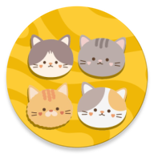
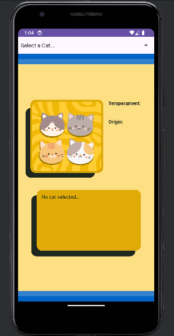
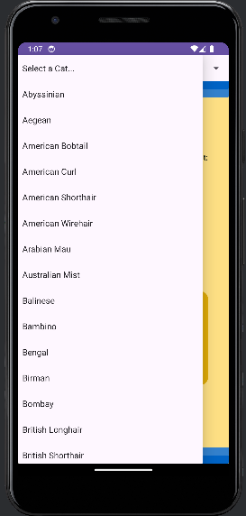
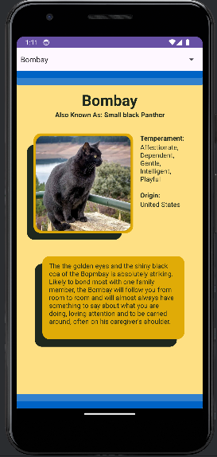
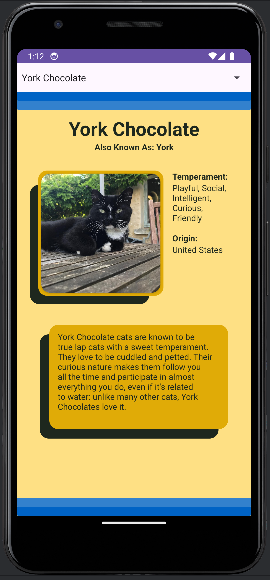

# Cat-App
This is a simple application designed to provide users with information about various cat breeds.


## Getting Started
To begin using Cat App, follow these steps:
- **Obtain Your API Key:** Visit [The Cat API](https://thecatapi.com/ "TheCatAPI") to obtain your API key. Refer to the [documentation](https://developers.thecatapi.com/view-account/ylX4blBYT9FaoVd6OhvR?report=FJkYOq9tW) for more details about the API key.
- **Update API Key:** After obtaining your API key, replace the placeholder string in `CatSelectionFragment.kt` and `CatInformationFragment.kt` with your actual API key:
```kotlin
private val apiKey = "REPLACE_WITH_YOUR_API_KEY"
```


## Features
- Select different cat breeds.
- View information about each cat breed, including name, alternate name, temperament, and origin.
- Display an image of the selected cat breed.
- Use a Web Service as the source of data and make API calls.


## User Interface
The following screenshots show the user interface, displaying different screens and interactions:


### Cat Breed Selection
| No Cat Selected        | Cat Selection           |
| ------------- |:-------------:|
|  |  |


### Cat Breed Information
| Bombay        | York Chocolate           |
| ------------- |:-------------:|
|  |  | 


## Technical Details
Here are the key components of the application:
- **API Usage:**
  - Integration of Volley for making API requests.
  - Parsing JSON responses from The Cat API to extract relevant information.
- **User Interface Elements:**
  - Implementation of a Spinner to allow users to select cat breeds.
  - Configuration of an ImageView and TextViews to display breed information.
  - Utilization of a ScrollView when viewing cat breed details.


## Development Environment
- IDE: Android Studio Hedgehog | 2023.1.1 Patch 2
- Language: Kotlin
